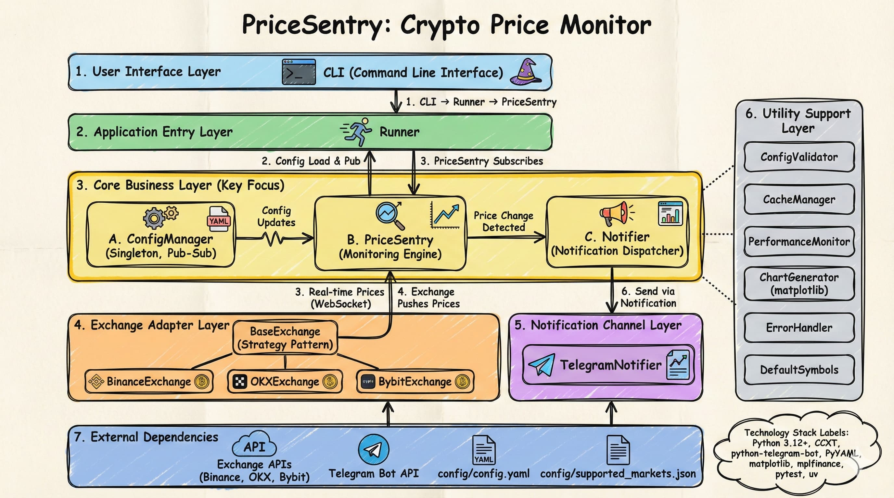

<div align="center">
  
  <h1>PriceSentry</h1>
  <p><strong>Lightweight Cryptocurrency Futures Price Monitoring Tool</strong></p>
</div>

<div align="center">
  <a href="LICENSE">
    
  </a>
  <a href="https://github.com/Xeron2000/PriceSentry/stargazers">
    
  </a>
  <a href="https://t.me/pricesentry">
    
  </a>
</div>

<p align="center">
  <a href="README.md">English</a> •
  <a href="README_CN.md">简体中文</a>
</p>

<br>

---

## ✨ Features

<table>
<tr>
<td width="50%">

**📊 Multi-Exchange Support**
- Binance, OKX, Bybit futures monitoring
- Real-time WebSocket price streaming
- Automatic market data sync

</td>
<td width="50%">

**🔔 Smart Notifications**
- Telegram instant alerts
- Optional candlestick charts
- Multi-language support (EN/CN)

</td>
</tr>
<tr>
<td width="50%">

**⚙️ Flexible Configuration**
- YAML-based config management
- Hot-reload support
- Default top 50 crypto by market cap

</td>
<td width="50%">

**🛡️ Production Ready**
- Built-in caching & validation
- Performance monitoring
- Error handling & retry logic

</td>
</tr>
</table>

> 💡 **Try it first:** Subscribe to [PriceSentry Channel](https://t.me/pricesentry) for live notifications.

<br>

---

## 🚀 Quick Start

### One-Command Setup (Recommended)

```bash
uvx --from git+https://github.com/Xeron2000/PriceSentry.git pricesentry
```

**First Run Setup:**

1. 🌍 Choose your language (English/中文)
2. 🤖 Get **Bot Token** from [@BotFather](https://t.me/botfather)
3. 💬 Get **Chat ID** from [@userinfobot](https://t.me/userinfobot)
4. 🏦 Select exchange (**OKX** or **Bybit** recommended)
5. ✅ Done! Market data updates automatically

<details>
<summary><b>📦 Manual Installation</b></summary>

```bash
# Clone repository
git clone https://github.com/Xeron2000/PriceSentry.git
cd PriceSentry

# Install dependencies
uv sync

# Create config
uv run python tools/init_config.py
vi config/config.yaml

# Update market data
uv run python tools/update_markets.py

# Start monitoring
uv run python -m app.cli
```

</details>

<br>

---

## ⚙️ Configuration

### Essential Settings

Edit `config/config.yaml`:

```yaml
# Exchange (okx, bybit, binance)
exchange: "okx"

# Timeframes
defaultTimeframe: "5m"  # 1m, 5m, 15m, 1h, 1d
checkInterval: "1m"

# Alert threshold (percentage)
defaultThreshold: 1

# Notification channels
notificationChannels:
  - "telegram"

# Symbols to monitor
# Use "default" for top 50 by market cap, or specify manually
notificationSymbols:
  - "BTC/USDT:USDT"
  - "ETH/USDT:USDT"
  - "SOL/USDT:USDT"

# Telegram configuration
telegram:
  token: "123456789:ABCdefGHIjklMNOpqrsTUVwxyz"
  chatId: "123456789"

# Timezone & Charts
notificationTimezone: "Asia/Shanghai"
attachChart: true
```

### Update Market Data

```bash
# Single exchange
uv run python tools/update_markets.py --exchanges okx

# Multiple exchanges
uv run python tools/update_markets.py --exchanges okx bybit

# All supported exchanges
uv run python tools/update_markets.py
```

<br>

---

## 🔧 Common Commands

| Action | Command |
|--------|---------|
| 🚀 Start monitoring | `pricesentry` or `uv run python -m app.cli` |
| ✏️ Edit config | `vi config/config.yaml` |
| 🔄 Update markets | `uv run python tools/update_markets.py` |
| 🧪 Run tests | `uv run pytest` |
| 🔍 Lint code | `uv run ruff check src/` |

<br>

---

## 🐛 Troubleshooting

<details>
<summary><b>❌ Error: No valid notification symbols</b></summary>

**Cause:** Incorrect symbol format or outdated market data

**Solution:**
```bash
# Check format in config (must be "BTC/USDT:USDT")
vi config/config.yaml

# Update market data
uv run python tools/update_markets.py --exchanges okx

# Restart
pricesentry
```
</details>

<details>
<summary><b>⏱️ Binance API timeout</b></summary>

**Cause:** Regional restrictions

**Solution:** Use OKX or Bybit instead
```yaml
exchange: "okx"  # or "bybit"
```
</details>

<details>
<summary><b>📱 Telegram not receiving messages</b></summary>

**Checklist:**
- ✅ Token format: `123456789:ABCdefGHIjklMNOpqrsTUVwxyz` (numbers:letters)
- ✅ Chat ID: pure numbers only
- ✅ Sent `/start` command to the bot
- ✅ Network accessible (some regions need proxy)
</details>

<br>

---

## 🏗️ Architecture

<div align="center">
  
</div>

### Core Components

```
┌─────────────────────────────────────────────────────────┐
│                    CLI Interface                        │
│              Interactive Config Wizard                  │
└─────────────────┬───────────────────────────────────────┘
                  │
┌─────────────────▼───────────────────────────────────────┐
│                  Core Business Layer                    │
│  ┌──────────────┐ ┌──────────────┐ ┌──────────────┐   │
│  │ConfigManager │ │  PriceSentry │ │   Notifier   │   │
│  │  (Singleton) │◄┤   (Engine)   │─┤ (Dispatcher) │   │
│  └──────────────┘ └──────┬───────┘ └──────────────┘   │
└───────────────────────────┼─────────────────────────────┘
                            │
         ┌──────────────────┼──────────────────┐
         │                  │                  │
┌────────▼────────┐ ┌───────▼───────┐ ┌───────▼────────┐
│ BinanceExchange │ │  OKXExchange  │ │ BybitExchange  │
│   (WebSocket)   │ │  (WebSocket)  │ │  (WebSocket)   │
└─────────────────┘ └───────────────┘ └────────────────┘
```

**Design Patterns:**
- 🔹 **Singleton:** ConfigManager
- 🔹 **Strategy:** Exchange Adapters
- 🔹 **Pub-Sub:** Config Update Mechanism
- 🔹 **Factory:** Exchange Creation

<br>

---

## 🛠️ Tech Stack

<table>
<tr>
<td width="50%">

**Core Dependencies**
- 🐍 Python 3.12+
- 📡 CCXT - Unified exchange API
- 💬 python-telegram-bot
- 📊 matplotlib + mplfinance
- 📝 PyYAML

</td>
<td width="50%">

**Development Tools**
- ✅ pytest - Testing framework
- 🔍 ruff - Linting & formatting
- 🔒 bandit - Security auditing
- 📦 uv - Package manager

</td>
</tr>
</table>

<br>

---

## 📄 License

This project is licensed under the **MIT License** - see the [LICENSE](LICENSE) file for details.

---

<div align="center">
  <p>
    <strong>Made with ❤️ for crypto traders</strong>
  </p>
  <p>
    <a href="https://github.com/Xeron2000/PriceSentry/issues">Report Bug</a> •
    <a href="https://github.com/Xeron2000/PriceSentry/issues">Request Feature</a> •
    <a href="https://t.me/pricesentry">Join Channel</a>
  </p>
  <p>
    If this project helps you, please give it a ⭐️
  </p>
</div>
