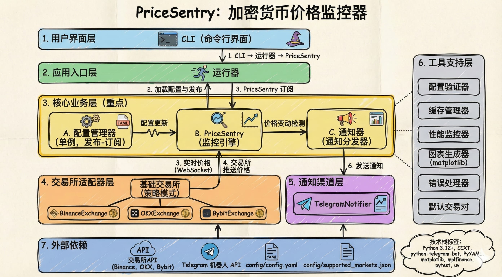

<div align="center">
  
  <h1>PriceSentry</h1>
  <p><strong>轻量级加密货币期货价格监控工具</strong></p>
</div>

<div align="center">
  <a href="LICENSE">
    
  </a>
  <a href="https://github.com/Xeron2000/PriceSentry/stargazers">
    
  </a>
  <a href="https://t.me/pricesentry">
    
  </a>
</div>

<p align="center">
  <a href="README.md">English</a> •
  <a href="README_CN.md">简体中文</a>
</p>

<br>

---

## ✨ 核心特性

<table>
<tr>
<td width="50%">

**📊 多交易所支持**
- Binance、OKX、Bybit 期货监控
- WebSocket 实时价格流
- 自动同步市场数据

</td>
<td width="50%">

**🔔 智能通知**
- Telegram 即时推送
- 可选 K 线图表附件
- 中英文双语支持

</td>
</tr>
<tr>
<td width="50%">

**⚙️ 灵活配置**
- YAML 驱动的配置管理
- 支持热重载
- 默认市值前 50 币种

</td>
<td width="50%">

**🛡️ 生产级可靠**
- 内置缓存和验证
- 性能监控
- 错误处理和重试机制

</td>
</tr>
</table>

> 💡 **先试用：** 订阅 [PriceSentry 频道](https://t.me/pricesentry) 获取实时通知。

<br>

---

## 🚀 快速开始

### 一键安装（推荐）

```bash
uvx --from git+https://github.com/Xeron2000/PriceSentry.git pricesentry
```

**首次运行配置：**

1. 🌍 选择语言（English/中文）
2. 🤖 从 [@BotFather](https://t.me/botfather) 获取 **Bot Token**
3. 💬 从 [@userinfobot](https://t.me/userinfobot) 获取 **Chat ID**
4. 🏦 选择交易所（推荐 **OKX** 或 **Bybit**）
5. ✅ 完成！程序会自动更新市场数据

<details>
<summary><b>📦 手动安装</b></summary>

```bash
# 克隆仓库
git clone https://github.com/Xeron2000/PriceSentry.git
cd PriceSentry

# 安装依赖
uv sync

# 创建配置
uv run python tools/init_config.py
vi config/config.yaml

# 更新市场数据
uv run python tools/update_markets.py

# 启动监控
uv run python -m app.cli
```

</details>

<br>

---

## ⚙️ 配置指南

### 核心配置项

编辑 `config/config.yaml`：

```yaml
# 交易所 (okx, bybit, binance)
exchange: "okx"

# 时间周期
defaultTimeframe: "5m"  # 1m, 5m, 15m, 1h, 1d
checkInterval: "1m"

# 价格变动阈值（百分比）
defaultThreshold: 1

# 通知渠道
notificationChannels:
  - "telegram"

# 监控交易对
# 使用 "default" 获取市值前50币种，或手动指定
notificationSymbols:
  - "BTC/USDT:USDT"
  - "ETH/USDT:USDT"
  - "SOL/USDT:USDT"

# Telegram 配置
telegram:
  token: "123456789:ABCdefGHIjklMNOpqrsTUVwxyz"
  chatId: "123456789"

# 时区和图表
notificationTimezone: "Asia/Shanghai"
attachChart: true
```

### 更新市场数据

```bash
# 单个交易所
uv run python tools/update_markets.py --exchanges okx

# 多个交易所
uv run python tools/update_markets.py --exchanges okx bybit

# 所有支持的交易所
uv run python tools/update_markets.py
```

<br>

---

## 🔧 常用命令

| 操作 | 命令 |
|------|------|
| 🚀 启动监控 | `pricesentry` 或 `uv run python -m app.cli` |
| ✏️ 编辑配置 | `vi config/config.yaml` |
| 🔄 更新市场数据 | `uv run python tools/update_markets.py` |
| 🧪 运行测试 | `uv run pytest` |
| 🔍 代码检查 | `uv run ruff check src/` |

<br>

---

## 🐛 故障排除

<details>
<summary><b>❌ 错误：无有效通知交易对</b></summary>

**原因：** 交易对格式不正确或市场数据未更新

**解决方案：**
```bash
# 检查配置文件格式（必须是 "BTC/USDT:USDT"）
vi config/config.yaml

# 更新市场数据
uv run python tools/update_markets.py --exchanges okx

# 重新启动
pricesentry
```
</details>

<details>
<summary><b>⏱️ Binance API 超时</b></summary>

**原因：** 地区限制

**解决方案：** 改用 OKX 或 Bybit
```yaml
exchange: "okx"  # 或 "bybit"
```
</details>

<details>
<summary><b>📱 Telegram 未收到消息</b></summary>

**检查清单：**
- ✅ Token 格式：`123456789:ABCdefGHIjklMNOpqrsTUVwxyz`（数字:字母）
- ✅ Chat ID：纯数字
- ✅ 已向机器人发送 `/start` 命令
- ✅ 网络可访问（部分地区需要代理）
</details>

<br>

---

## 🏗️ 系统架构

<div align="center">
  
</div>

### 核心组件

```
┌─────────────────────────────────────────────────────────┐
│                    CLI 命令行界面                        │
│                   交互式配置向导                         │
└─────────────────┬───────────────────────────────────────┘
                  │
┌─────────────────▼───────────────────────────────────────┐
│                   核心业务层                            │
│  ┌──────────────┐ ┌──────────────┐ ┌──────────────┐   │
│  │ 配置管理器   │ │  监控引擎    │ │  通知分发器  │   │
│  │ (单例模式)   │◄┤ PriceSentry  │─┤   Notifier   │   │
│  └──────────────┘ └──────┬───────┘ └──────────────┘   │
└───────────────────────────┼─────────────────────────────┘
                            │
         ┌──────────────────┼──────────────────┐
         │                  │                  │
┌────────▼────────┐ ┌───────▼───────┐ ┌───────▼────────┐
│ Binance 适配器  │ │  OKX 适配器   │ │ Bybit 适配器   │
│  (WebSocket)    │ │  (WebSocket)  │ │  (WebSocket)   │
└─────────────────┘ └───────────────┘ └────────────────┘
```

**设计模式：**
- 🔹 **单例模式：** 配置管理器
- 🔹 **策略模式：** 交易所适配器
- 🔹 **发布-订阅：** 配置更新机制
- 🔹 **工厂模式：** 交易所创建

<br>

---

## 🛠️ 技术栈

<table>
<tr>
<td width="50%">

**核心依赖**
- 🐍 Python 3.12+
- 📡 CCXT - 统一交易所 API
- 💬 python-telegram-bot
- 📊 matplotlib + mplfinance
- 📝 PyYAML

</td>
<td width="50%">

**开发工具**
- ✅ pytest - 测试框架
- 🔍 ruff - 代码检查和格式化
- 🔒 bandit - 安全审计
- 📦 uv - 包管理器

</td>
</tr>
</table>

<br>

---

## 📄 许可证

本项目采用 **MIT License** 许可 - 详见 [LICENSE](LICENSE) 文件。

---

<div align="center">
  <p>
    <strong>用 ❤️ 为加密货币交易者打造</strong>
  </p>
  <p>
    <a href="https://github.com/Xeron2000/PriceSentry/issues">报告问题</a> •
    <a href="https://github.com/Xeron2000/PriceSentry/issues">功能建议</a> •
    <a href="https://t.me/pricesentry">加入频道</a>
  </p>
  <p>
    如果这个项目对你有帮助，请给它一个 ⭐️
  </p>
</div>
