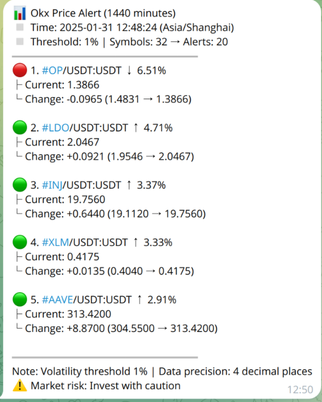

<div align="center">
  
</div>

<div align="center">
  <a href="README.md">English</a> | <a href="README_zh.md">中文</a>
</div>
<br>
<div align="center">
  <a href="https://www.python.org/">
    
  </a>
  <a href="LICENSE">
    
  </a>
  <a href="https://github.com/Xeron2000/PriceSentry/stargazers">
    
  </a>
</div>

<h3 align="center">交易者和爱好者打造的轻量级加密货币合约价格监控工具🚨</h3>
<h4 align="center" style="color: #666;">追踪·分析·保持敏锐</h4>

---

## 🌟 核心功能

- 🔔 多渠道智能提醒（Telegram & 钉钉）
- 🌐 支持 Binance 和 OKX 交易所
- 📆 时区感知通知
- 🔒 使用 YAML 文件安全配置

---

## 🛠 系统要求

| 组件           | 要求                  |
|----------------|----------------------|
| Python         | 3.6 或更高版本       |
| 内存           | 512MB 以上           |
| 存储空间       | 100MB 可用空间       |
| 网络           | 稳定互联网连接       |

---

## 🚀 快速安装

### 1. 安装依赖
```bash
sudo apt update && sudo apt install -y python3 python3-pip
```

### 2. 克隆仓库
```bash
git clone https://github.com/Xeron2000/PriceSentry.git
cd PriceSentry
```

### 3. 安装依赖包
```bash
pip install -r requirements.txt
```

---

## 🔧 配置指南

### 🤖 Telegram 设置
1. 通过 [@BotFather](https://t.me/BotFather) **创建机器人**
2. **获取 Chat ID**：
   ```bash
   curl https://api.telegram.org/bot<你的TOKEN>/getUpdates | jq
   ```

### 📟 钉钉设置
1. 创建群机器人并选择**自定义安全设置**
2. 启用签名验证并保存：
   - Webhook地址（`https://oapi.dingtalk.com/robot/...`）
   - 加签密钥

---

## ⚙️ 配置文件 (`config/config.yaml`)

```yaml
# 交易所和默认行为配置
# 要连接的交易所名称
# 可选值："binance", "okx"
exchange: "okx"  # 示例："binance"

# 默认时间周期（数据获取频率）
# 可选值："1m", "5m", "15m", "1h", "1d"
defaultTimeframe: "1d"  # 示例："5m"

# 默认价格变化阈值，仅超过该值的交易对会触发通知
defaultThreshold: 1  # 示例：1

# 交易对文件路径，留空则自动获取
symbolsFilePath: "config/symbols.txt"  # 示例："config/symbols.txt"

# 通知渠道配置
# 当前支持 Telegram 和钉钉
notificationChannels: 
  - "telegram"
  - "dingding"

# Telegram 机器人配置
telegram:
  token: ""  # 示例："你的机器人令牌"
  chatId: ""  # 示例："你的聊天ID"

# 钉钉机器人配置
dingding:
  webhook: ""  # 示例："https://oapi.dingtalk.com/robot/send?access_token=你的访问令牌"
  secret: ""  # 示例："你的签名密钥"

# 通知时区配置
# 默认亚洲/上海时间
notificationTimezone: "Asia/Shanghai" # 示例："America/New_York"
```

---

## 🔔 通知示例

<div style="text-align: center;">
  
</div>

---

## 🕒 定时任务设置

```bash
# 编辑定时任务
crontab -e

# 添加定时任务（每5分钟执行）
*/5 * * * * /usr/bin/python3 /项目路径/PriceSentry/main.py >> /日志路径/logs.txt 2>&1
```

---

## 📜 开源协议

本项目采用 MIT 开源协议，详见 [LICENSE](LICENSE)。

---

<p align="center">
  <em>由 Xeron 用心制作 ❤️</em><br>
  <a href="https://github.com/Xeron2000/PriceSentry/issues">报告问题</a>
</p>
